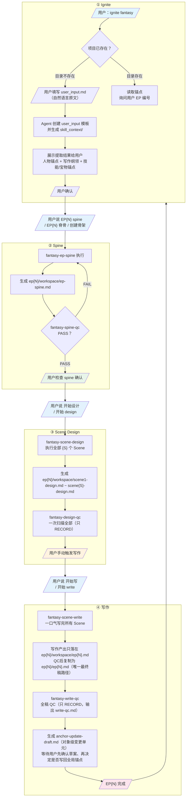

# Fantasy 全写 Pipeline — 工作流图

---

## 锚点文件位置

| 文件 | 路径 | 说明 |
| 人物锚点 | `skill_context/人物锚点.md` | 全局事实层，仅在用户确认后更新 |
| 技能锚点 | `skill_context/技能锚点.md` | 全局事实层，仅在用户确认后更新 |
| 宝物锚点 | `skill_context/宝物锚点.md` | 全局事实层，仅在用户确认后更新 |
| EP锚点 | `skill_context/EP锚点.md` | 全局事实层，仅在用户确认后更新 |
> **EP{N+1} 入点 = 已结清的全局锚点；若 EP{N} 仍有 pending `anchor-update-draft.md`，必须先结清再进入下一 EP。**

---

## QC 链路

| 阶段 | QC Skill | 判定 |
|------|---------|------|
| Spine | `fantasy-spine-qc` | PASS → 停在 QC 后，等用户确认是否进入 Scene Design；FAIL → 重跑 Spine |
| Scene Design | `fantasy-design-qc` | 一次扫描全部，只 RECORD，不 FAIL；QC 后等用户手动触发写作 |
| EP 全稿 | `fantasy-write-qc` | 只 RECORD，不 FAIL；输出 `ep{N}/workspace/write-qc.md`，生成 `anchor-update-draft.md` 并等待用户先确认草案、再决定是否更新全局锚点 |

---

## 四段式结构

| 阶段 | 触发 | 产出 | 确认节点 |
|------|------|------|---------|
| **① Ignite** | `ignite fantasy` / `ignite EP{N}` | skill_context + user_input | 展示结果 → 用户确认 |
| **② Spine** | `EP{N} spine` 等 | ep{N}/workspace/ep-spine.md | spine-qc PASS → 用户确认 |
| **③ Scene Design** | `开始设计` / `开始 design` / `EP{N} 设计` | scene{X}-design.md（全量） | design-qc → 用户手动触发写作 |
| **④ 写作** | `开始写` / `开始 write` / `进入写作` / `EP{N} 写作` | ep{N}.md + anchor-update-draft.md + write-qc.md | write-qc → 用户先确认锚点草案 / 再决定是否更新锚点 / 下次 ignite 前强制结清 → EP完成 |

---

## 手动确认节点（用户操作）

1. **Ignite** — Agent 生成 skill_context 后 → 展示关键文件 → 用户确认
2. **Spine QC PASS 后** — 用户检查 spine，确认后触发 Scene Design
3. **Scene Design QC 后** — 用户手动触发写作
4. **Write QC 完成后** — 用户先决定是否立即确认 `anchor-update-draft.md` 草案；若要真正写回全局锚点，再执行更新；若不应用，则下一章 ignite 前必须先结清

---

## EP 收尾规则

- `ep{N}/workspace/write-qc.md`：保存全稿 QC 报告
- `ep{N}/workspace/anchor-update-draft.md`：保存候选锚点更新
- `ep{N}/ep{N}.md`：保存最终稿
- 若 draft 未应用，则下一次 `ignite EP{N+1}` 前必须先结清
